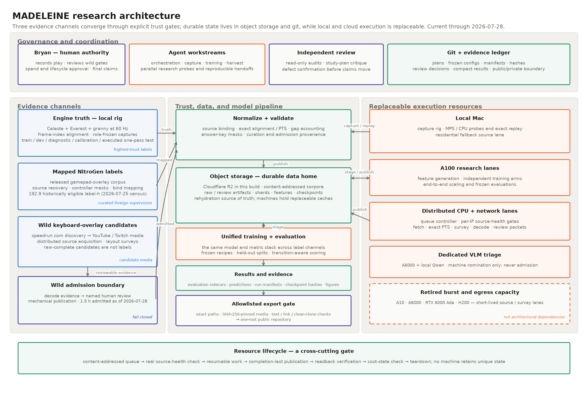
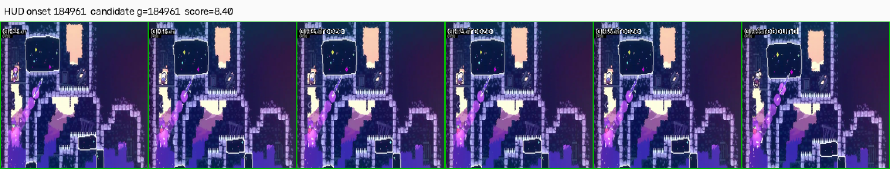
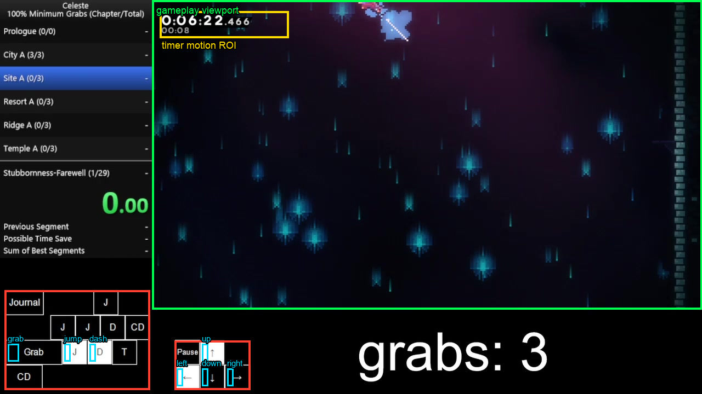

# MADELEINE

Measurement And Decoding of Evidence-Linked Environment Inputs via Neural
Estimation: recovering player actions from gameplay video.

Given a window of *Celeste* frames before and after a moment, the model
predicts the seven controls that produced the motion: left, right, up, down,
jump, dash, and grab. The project is inspired by
[Video PreTraining (VPT)](https://arxiv.org/abs/2206.11795) but centers on
measurement: aligning video to engine frames exactly, preventing answer-key
leakage from on-screen overlays, separating held-state recognition from
transition timing, and testing whether noisy internet-derived labels
transfer to engine-recorded actions.

In Proust, a madeleine is the sensory trace that recovers a lost past; an
inverse dynamics model does the same, recovering the action from the frames
it left behind. In *Celeste*, the protagonist is Madeline. The recorder
is `theo` (the character
who documents everything), the verifier is `goldenberry` (the golden
strawberry certifies a deathless run, which is exactly what the verifier
issues: a certificate that the record is clean), and the IDM itself is
`badeline`, the reflection who knows your every move. Engine truth comes
from `granny`, the observer who is never fooled.

The work sits in a longer lineage, discussed with citations in the report's
[relation to prior work](report/README.md#relation-to-prior-work): inverse
dynamics models in robotics (Agrawal et al. 2016; Nair et al. 2017),
imitation from observation (Torabi et al.'s BCO, 2018), learning from
unlabeled YouTube gameplay (Aytar et al. 2018), VPT's use of an IDM to
pseudo-label internet video at scale (Baker et al. 2022), latent-action
models that dispense with action labels entirely (LAPO and Genie, 2024),
and the NitroGen gamepad-overlay corpus (NVIDIA, 2026) that supplies this
project's mapped labels.

**Reading paths:** [findings in five minutes](#findings-so-far) ·
[the technical report](report/README.md) ·
[how this was built: a three-day agent-orchestrated sprint](docs/history/how-this-was-built.md) ·
[curated engineering lessons](docs/engineering-lessons.md)


*One frame from the calibration session. The rig renders a frame index (top
left, decoded per frame for clock-free alignment), an opaque engine-truth
overlay (bottom left), and a translucent HUD (bottom right, the wild-decode
calibration target). Dashed rectangles are the declared mask regions.*


*Thirty seconds of a self-recorded session
([higher-quality mp4](results/figures/fig_pred_overlay.mp4)), scored frame by frame by an
end-to-end model trained only on mapped NitroGen labels and evaluated here
against engine truth. Left: the capture, with the declared mask regions
dashed. Right: the literal 128×128 masked input the network consumes, a
gradient-saliency view of it, and the seven per-key probabilities against
engine-truth key state at the 0.5 threshold. The bottom strip is the model's
actual input window — 32 consecutive frames centered on the current moment —
shaded by gradient magnitude per frame. The running tally lands near this
split's 68% frame/key accuracy; for context, always predicting "released"
scores 82.9% on the same frames, which is why per-frame accuracy is
[not a headline metric here](results/idm/KEYPRESS_ACCURACY.md). The clip
window was selected by a deterministic rule stated in the generating script,
and moments where the capture dropped frames or the model has no prediction
appear as explicit gaps.*

## What is in the repository



Three evidence channels of different trust converge through explicit gates
into one training and evaluation stack; durable state lives in object storage
and Git, execution is replaceable, and results leave only through an
allowlisted export gate. The diagram is generated from
[a tracked script](experiments/figures/fig_research_architecture.py), which
cites the tracked documents its facts are drawn from. The dated build-sprint
snapshot it supersedes lives in
[the project history](docs/history/how-this-was-built.md).

- `granny/InputTruth/` — the engine-truth instrumentation, an
  [Everest](https://everestapi.github.io/) mod (the subdirectory keeps the
  compatibility assembly name). It records the seven controls
  and player state per engine frame at 60 Hz and renders a machine-readable
  frame index for clock-free video alignment.
- `theo/` and `data/` — screen capture, frame-index decoding, session assembly
  and validation, answer-key masking, and shard construction for locally
  recorded sessions.
- `badeline/` — ResNet-based visual encoders, GRU temporal models, training,
  evaluation, and transition-aware metrics.
- `nitrogen/` — source-video recovery, controller masking, action mapping, and
  quality metadata for the
  [NitroGen](https://huggingface.co/datasets/nvidia/NitroGen) action-label
  corpus.
- `harvest/` — a pipeline built end to end during this project to recover
  keyboard actions from the input displays speedrunners publish — a label
  source that gamepad-widget harvesting cannot see. Human-reviewed geometry,
  timing, and provenance gates fail closed.
- `goldenberry/` — consistency checks for deciding whether a video and action
  record agree.
- `experiments/` and `results/` — frozen configurations, evaluation
  reports, hashes, and measured results (launcher scripts and prediction
  sidecars remain in the private working repository).

## Findings so far

### Measurements against engine truth

These rest on the local capture rig and are the most solidly established
results in the project.

- Alignment requires no clock synchronization: a frame index rendered into
  the game pins every video frame to its engine frame. The chain was
  verified end to end when a classical parser read the input overlay off
  53,369 video frames and matched the engine log at macro-F1 1.0.
- The current frame often does not determine the action. At tight state
  tolerance, 44.8% of active frames have a temporally separated,
  near-identical engine-state neighbor with a different action, and the
  resulting trajectories separate over the following 8–16 frames. This is
  the empirical case for giving an inverse dynamics model future context.
- Label timing error costs far more than video degradation. Shifting labels
  by one frame costs 4.5% macro-F1 (four frames: 17.3%), while the tested
  internet-grade transcodes down to 480p produced no measurable loss on
  retained, realigned frames of a legible overlay.
- Per-frame metrics reward trivial predictors. Copying the previous frame's
  keys scores 0.912 per-frame AP and 99.0% per-key accuracy, but 0.000
  transition-event F1 at an exact-frame collar. Both metric families are
  therefore reported, with different jobs: per-frame accuracy is computed
  under the closest readings of VPT's (undefined) metric for
  comparability, while transition-event F1 is the headline, because the
  accuracy reading cannot tell a model from a copy. Accuracy tables always
  carry the trivial baselines that make this visible.
- Forty minutes of engine-truth data was not enough to train on, under the
  captures, architectures, and protocol tested. Every pixels-only model
  memorized its training sessions (training BCE 0.05, held-out sessions at
  chance), and recording 2.7× more data changed nothing. This result is
  what justified turning to foreign labels.

### Model results (development split, plus one executed untouched test)

- A model trained only on 13.45 hours of mapped NitroGen labels — no
  engine-truth frames in training — beat matched engine-truth-only training
  on engine-truth evaluation in every paired seed (+0.0241 macro AP,
  +0.0136 exact transition F1 against the mask-corrected reruns), zero-shot. Fine-tuning on the local data
  was tested and rejected because it degraded exact timing in every seed.
- End-to-end vision, more capacity, and longer context each improved state
  recognition but not exact timing. The best state model reached 0.2461
  macro AP against a 0.1715 prevalence baseline (the AP of a constant
  predictor — each key's press rate) while its exact event F1
  fell. Our proposed mechanism — consistent with LAPO's observation that
  latent policies model the visible effects of actions rather than the
  actions themselves — is that pixel-driven objectives recover effect
  timing, not press timing; establishing that here remains open.
- Cross-video transfer exists on mapped labels, and it scales with the
  corpus. Trained on nine NitroGen videos (38 h) and evaluated on a tenth,
  a 25.7M model scored 0.2435 macro AP against 0.1924 prevalence, every
  key above its own base rate. Scaling the same recipe to the full corpus
  raised the held-out AP to 0.2693 (103 h, higher-confidence bindings) and
  0.2723 (148 h, all bindings); under the closest reading of VPT's
  accuracy metric the same models rose from 63.3% to 68.5% (103 h; 66.1%
  at 148 h), with joint exact-match accuracy climbing 4.3% → 11.3%. On
  engine-truth capture, the 148-hour model posts the project's best exact
  transition matching yet. Exact event timing on the mapped holdout stays
  near 0.01 F1 at every scale — the recognition-versus-timing split again.

### A new label channel: wild keyboard overlays

Existing harvesting reads gamepad widgets, so it cannot see the input
displays that keyboard players publish — including the runners at the top
of the game's leaderboards. Opening that channel meant building it end to
end: enumeration, a style survey, a decoder, calibration against engine
truth, and admission control.

- Enumerating the speedrun.com Celeste leaderboards found 7,071 fresh PC
  videos carrying 6,757 hours of footage. A stratified survey (60 sampled,
  55 successfully probed) found about 15% show an on-screen input display, and the dominant style is a
  translucent action HUD rather than the opaque key grid prior work
  assumes.
- Translucent overlays are decodable. Reading each cell's contrast against
  its local background recovered engine truth at macro-F1 0.9977 without
  supervision, matching 873 of 874 onsets at a median offset of zero
  frames.
- 33 media hours are fetched and byte-verified so far. Admission requires
  hash-bound human review of layout, gameplay boundaries, and timing offset,
  plus mechanical decode and publication gates that no reviewer can waive —
  and the funnel held every hour at zero until all gates closed. The first
  six videos cleared their human reviews on 2026-07-28, and the first
  publications completed the same day: 4.95 hours are published through
  every gate (four videos, a million train-ready frames), two more videos
  are decode-admitted with ~7.3 hours mid-publication, and one more
  human-cleared video is queued. In a controlled single-seed blend test,
  substituting provisionally decoded wild labels for a fifth of the
  NitroGen draws cost no measurable AP (wild's marginal effect +0.0033;
  the blends trailed pure NitroGen because the corrected-local fraction
  hurt, −0.0106 with no wild involved) — an early supervision-quality
  signal for the funnel, measured before any hour was admitted.

#### What the human review looks like



*Six consecutive masked gameplay frames around one claimed dash press, from
the timing-offset review of one harvested video. Celeste freezes the engine
for several frames when a dash starts, then motion bursts outward. If the
calibrated video-to-input offset is correct, the freeze sits exactly where
the labels claim — `g+1` through `g+3` identical — and motion returns at
`g+4`, here with the dash trail visible. The reviewer scans twelve such rows
per video and either sees the pattern at the claimed offset or rejects the
calibration.*

This contact sheet is the third of three human gates each video passes
before its labels can enter training: layout review (do the proposed
rectangles read the input display?), boundary review (are the proposed
gameplay ranges real gameplay?), and offset review (does the freeze evidence
support the measured video-to-input lag?). The layout gate's evidence looks
like this — the proposed gameplay viewport, timer region, and per-key HUD
cells drawn over the original stream layout for the reviewer to confirm or
reject:



*The layout gate's geometry overlay: proposed gameplay viewport, timer
region, and per-key HUD cells drawn over the original stream layout.*

Every decision is recorded as an
acceptance artifact that hash-binds the source video, the evidence reviewed,
and a named reviewer with declared provenance; automatic stages propose all
of it but can never admit. For what a live review packet contains, see
[the ss3nhAUaScE boundary packet](results/wild20/ss3nhAUaScE/review_packet_boundaries/REVIEW.md):
106 AI-proposed gameplay ranges, an annotated full-video trace with a
render-time completeness assertion, timestamped spot-check pages against the
raw source — and, by rule, no decision inside the packet itself: the
reviewer's ruling lives only in a separate hash-bound acceptance artifact.
The gates also refuse. The corpus's largest reviewed video (5.77 cleanly
decoded hours, layout and boundaries both human-approved) hard-failed the
offset gate the same day the first admissions landed: its dash-hitstop
evidence was genuinely mixed — median margin 0.24 against a 2.0 floor,
temporal blocks disagreeing on the winner — and no reviewer tier can waive
that, so its hours stay out pending an independent offset measurement. A
funnel that only ever admits is not a gate; this one demonstrably refuses.
The review sessions themselves are recorded in
[a start-to-finish walkthrough](docs/wild-review-walkthrough.md), and the
pipeline map is [harvest/README.md](harvest/README.md).

### Corpus provenance

- Only 31% of the label-hours in the public NitroGen Celeste release could
  still be retrieved from source at census time (2026-07-25, by our fetch
  method). Every unretrievable source was Twitch-hosted while all YouTube
  sources remained live — consistent with
  [Twitch's documented VOD retention windows](https://help.twitch.tv/s/article/video-on-demand)
  — and the loss is top-heavy: the eight largest dead videos account for
  about 54 hours.

These development numbers were then put to the decisive test. A sealed,
pre-registered untouched engine-truth session — an unseen chapter, scored in
exactly one pass with frozen checkpoints and thresholds — came back
substantially lower: best macro AP 0.2377 against 0.1515 prevalence chance,
with the mapped-supervision families above chance and the own-data models
near it (details in the
[results summary](results/idm/SUMMARY.md) and
[results/idm/untouched_test/](results/idm/untouched_test/UNTOUCHED_TEST.md)).
The numbers are reported as found; nothing was tuned afterward, and the
session is spent. The pre-registered multi-chapter battery
([registration](results/idm/UNTOUCHED_BATTERY_PREREGISTRATION.md), frozen
before its sessions were recorded; results in
[results/idm/untouched_battery/](results/idm/untouched_battery/UNTOUCHED_BATTERY.md))
executed the same day: four fresh chapters, sixteen frozen models, one pass
each. Pooled best macro AP 0.2667 against ~0.16 pooled chance. Every battery
chapter shows above-prevalence action signal, confirming the Chapter 6
result was neither an isolated success nor an isolated failure; performance
varies by content (Chapter 1 is slightly harder than Chapter 6 for the best
model, Chapters 2–4 easier), and exact timing remains weak everywhere.
The own-data models sit in a narrow near-chance band on every chapter
including their training-adjacent anchor, so their limit is generalization,
not content shift; exact-frame event F1 stays 4–8× the shuffled-event
anchor but at most ~0.05 everywhere — the timing wall holds on every
chapter, which is exactly what the next experiment interrogates: a frozen
counterfactual identifiability study
([the full design](results/idm/COUNTERFACTUAL_INPUT_IDENTIFIABILITY_PLAN.md))
is queued to measure whether exact press timing is observable from pixels
at all — deterministic replay with the press moved frame-by-frame,
counting byte-distinguishable candidates.

See [the technical report](report/README.md),
[the results summary](results/idm/SUMMARY.md), the
[NitroGen-only holdout report](results/idm/NITROGEN_HOLDOUT.md), and the
[corpus audit](results/idm/CORPUS_AUDIT.md) for complete metrics and
caveats.

## Research principles

1. **Mask the answer key.** Frame-index strips and visible controller or
   keyboard overlays are removed before model input.
2. **Preserve temporal truth.** Windows never cross a missing chunk, frame-index
   discontinuity, or capture reset. Small repeated frames may be retained and
   are reported separately.
3. **Evaluate timing directly.** Per-frame accuracy is dominated by held keys
   and no-op frames. Reports pair average precision and state F1 with onset and
   release F1 at exact and tolerant frame collars.
4. **Keep label kinds distinct.** Engine truth, mapped NitroGen labels, and
   visually decoded wild labels are never presented as equivalent supervision.
5. **Freeze roles before inference.** Development, calibration, and untouched
   test sessions have different jobs; using an asset changes what can be
   claimed from it.
6. **Archive evidence, not just weights.** Each result keeps its configuration,
   run metadata, predictions, data identity, and checkpoint hash.

## Quick start

The Python project is pinned to Python 3.12 and uses
[`uv`](https://docs.astral.sh/uv/).

```bash
uv sync
uv run pytest -q
uv run python -m badeline.train --help
uv run python -m badeline.eval --help
```

The synthetic-fixture suite passes on a fresh clone (`uv run pytest -q` → 791
passed, 59 skipped at this release); skipped tests require private artifacts listed in 'What
is public'. It does not reproduce an experiment end to end, since that requires
data the repository does not distribute. Reproducing capture requires a local copy of *Celeste*,
the Everest mod loader, and the `granny`/`InputTruth` mod. Reproducing corpus experiments requires obtaining NitroGen labels and
source videos under their respective terms; large data and checkpoints are
intentionally not stored in Git.

The session contract is documented in
[specs/session_format.md](specs/session_format.md). The current research roadmap
is [PLAN.md](PLAN.md), measured status is [PROGRESS.md](PROGRESS.md), and
[CLAUDE.md](CLAUDE.md) is the contributor and agent operating guide. The full
documentation index is [docs/README.md](docs/README.md).

## Reproducibility

- `uv.lock` pins the Python environment.
- Experiment JSON files pin architectures and optimization settings.
- Run directories retain configuration, metadata, logs, and evaluation
  sidecars.
- Checkpoint hashes are tracked even when the large checkpoint files are not.
- Dataset membership, mapping confidence, decoder mode, continuity, and label
  provenance are explicit manifest fields.
- Engine-truth evaluation and mapped-label evaluation are reported separately.

Cloud-specific paths in launch scripts are defaults for the recorded runs
and can be overridden through environment variables. Detailed
infrastructure notes remain in the private working repository; the
[build retrospective](docs/history/how-this-was-built.md) summarizes the
topology without hosts or credentials.

## What is public

The public export contains the code, tests, specifications, documentation,
figures, and compact result reports (aggregate metrics, checkpoint hashes,
run configurations). It does not contain gameplay video, the NitroGen label
corpus, feature shards, model checkpoints, prediction arrays, session
manifests, or split lists — those remain in the private working repository,
and documents that cite them say so.

The repository is published as a single squashed commit: a deliberate clean
cut from the private working repository, whose dated development history is
summarized in the [build retrospective](docs/history/how-this-was-built.md)
and the chronological logs. Commit identifiers cited inside documents
(pre-registration records, engineering notes) refer to that private history;
they authenticate the working record and do not resolve from this squashed
public history. Model checkpoints are not distributed; their
SHA-256 hashes are tracked, and weights are available on request against
those hashes.
