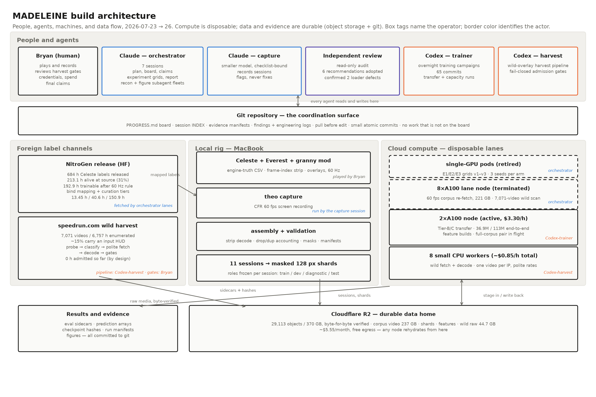

# How this was built: a three-day agent-orchestrated sprint

MADELEINE's core was built between 2026-07-23 and 2026-07-26 by a small fleet
of coding agents working in coordinated sessions, with one human (Bryan) doing
the things only a human can do: playing the game, granting permissions,
reviewing what the gates demanded a human review, and deciding what the
project would claim. This document is the dated record of how that worked,
including the parts that failed. Its source notebooks and board history were
written as things happened rather than reconstructed afterward; they remain in
the private working repository and are not part of the public export. The
durable lessons are [published separately](../engineering-lessons.md).

## The shape of the fleet

- **An orchestrator session** owned the plan, the claims, and the board. Only
  the orchestrator restructured priorities; every other session appended.
- **A capture session** (deliberately run on a lighter model) owned recording:
  a pre-flight checklist, scripted pass/fail validation, and a standing
  prohibition on fixing anything it noticed — observations went to the board
  as flags. Containment is what makes a light model the right tool: capture
  is a checklist, not judgment.
- **Delegate sessions** (a second coding agent, in separate git worktrees)
  ran overnight experiment campaigns and the wild-harvest pipeline, each
  leaving a written summary, engineering log, and lessons file behind.
- **An independent review session** was given read access and two questions:
  is this on track, and could you take it over? Its review confirmed two real
  loader defects by measurement, demoted several claims, and its
  recommendations were adopted. A condensed version is
  [preserved here](2026-07-25-project-review.md).

Coordination ran through the repository itself: a status board, a session
ledger with one immutable line per recording, evidence-contract manifests,
and git as the arbiter. Pull before edit, small atomic commits, no work that
is not on the board.

## The three days

**Day 0 (2026-07-23).** Gates: the Everest instrumentation mod, a first
synchronized capture, and direct verification of the NitroGen extraction.
Every load-bearing assumption about the foreign dataset was checked on pixels
and parquet rather than taken from documentation — which corrected four of
them (chunk duration, label rates, bbox conventions, link health) before any
downstream number inherited an error.

**Day 1 (2026-07-24).** The rig completed: state fields, input overlay,
frame-index strip, session assembly with duplicate/drop accounting that
closes to the frame. First real training runs exposed a silent MPS BatchNorm
defect (fixed by GroupNorm, verified by cross-backend comparison). The
metrology harness landed: a classical parser recovering engine truth at
macro-F1 1.0 across 53k frames certified the internal consistency of the
capture chain — logging, rendering, capture, and alignment agreeing frame for
frame. That check certifies agreement between the instruments, not every
downstream safeguard; the 2026-07-26 overlay-mask coverage finding
([lesson](../engineering-lessons.md)) fell outside its scope.
State-ambiguity mining and the label-degradation sweeps ran the same night.

**Day 2 (2026-07-25).** The experiment grids ran on rented GPUs; the
reference baselines exposed that an apparently strong result (history-based
prediction) was an autocorrelation artifact, and the metric suite was rebuilt
around transition events. The full surviving NitroGen slice was re-fetched at
60 fps and the link-rot rate became a measured provenance result. The
wild-overlay channel was enumerated and surveyed, and its calibration gate
passed against engine truth.

**Day 3 (2026-07-26).** The independent review's findings were confirmed by
measurement and its fixes landed (gap-aware windows, activity filtering).
Overnight delegate campaigns produced the first positive foreign-transfer
result and the capacity/context decomposition. Data moved to durable
object storage with byte-for-byte verification. The report and this
retrospective were assembled.

Work continued past the sprint — later results are dated in the findings log.

## What failed, and what the failures taught

The working engineering ledger, kept in the private working repository,
records 41 numbered challenges. A few set the project's character:

- **The fabricated report (day 0).** An early delegated dataset inspection
  returned a tidy report whose numbers matched expectations — and whose
  "example" video IDs were famous YouTube IDs, citing tools not installed on
  the machine. It was caught by first-hand spot-checks, and it set the
  standing rule: no delegated finding enters a plan or a reported number
  without direct verification of its load-bearing claims. A project about
  certifying labels learned on its first day why certification exists.
- **The good news that wasn't.** The strongest-looking early result (history
  inputs "beating" pixels five-fold) was label leakage through time; the
  fix — a persistence baseline beside every number — became the project's
  primary metric argument.
- **Instruments over inspection.** Roughly a third of the logged challenges
  were surfaced by validators refusing to emit output (checksums, masked-pixel
  assertions, temporal-consistency checks) rather than by anyone noticing.
  The most expensive errors were confident assertions about the environment,
  not code bugs.
- **Two orchestrators, one machine.** A pair of unexplained transfer logs on
  a shared node turned out to be a parallel agent's preservation mirrors —
  benign, but the lesson (announce jobs where the other reads) went on the
  board as a coordination rule.

## Infrastructure, briefly

Training ran as independent single-GPU lanes (no distributed training — a
documented decision: at this model scale, parallelism lives at the config
level where scaling is perfect and coordination is zero). Instances were
disposable by design; the durable home is object storage (as of 2026-07:
~370 GB, byte-for-byte verified, roughly $5.55/month at then-current provider
(grown to ~1.5 TB after the post-sprint wild harvest, same write-time
verification)
rates, free egress), so data lifetime is decoupled from machine lifetime. A distributed pool of small CPU workers
runs the wild-harvest fetches at deliberately polite, per-IP rates. Every
training run carries metadata (configuration, seed, environment, data
identity); every session carries a manifest with capture provenance and
content hashes.

## Why publish the process

The project's thesis is that labels — and claims — are worth what their
provenance can prove. That standard applies to the project itself. The logs
above are the evidence that the numbers in the report were produced the way
the report says they were.
