# Recovering actions from *Celeste* video

## Abstract

MADELEINE (Measurement And Decoding of Evidence-Linked Environment Inputs
via Neural Estimation) is an inverse dynamics study: given gameplay frames before and after
a target moment, predict which of seven *Celeste* controls produced the observed
motion. The project combines exact engine instrumentation, clock-free capture
alignment, mapped action labels from public gameplay, transition-aware metrics,
and models ranging from frozen visual features to end-to-end temporal networks.

The main result is not one best score. It is a separation between
**action-state recognition** and **event timing**. Training on curated mapped
labels alone — zero engine-truth frames — improved both development-set
state AP and exact event F1 over engine-truth-only training in every paired
seed, while fine-tuning on the small gold set degraded timing and was
rejected. Subsequent increases in data scale, temporal capacity, and
trainable vision improved state recognition more consistently than they
sharpened event timing. This points to transition-aware objectives,
checkpoint selection, and label timing as separate bottlenecks from visual
recognition.

The report also covers what the instrumentation measured directly: how often
the present underdetermines the action and how far ahead the future resolves
it; what a frame of label jitter costs against what compression costs; why
per-frame metrics reward a trivial copy rule; how much of a public label
corpus still exists at re-fetch time; and whether a translucent input
overlay in wild speedrun video can be decoded against engine truth (it can,
at 0.9977 macro-F1, unsupervised).

## Research question

An action is not always identifiable from one image. The player can revisit a
nearly identical state while choosing a different input, and the effect of that
input may become visible only several frames later. At the same time, a model
can appear strong by copying persistent controls, recognizing one player's
route, or reading a visible controller overlay.

The project therefore asks:

1. Does future context help beyond an equally long history?
2. Does more mapped internet supervision improve transfer to engine truth?
3. Is model capacity better spent on the visual encoder or temporal head?
4. Why does exact onset/release timing lag held-action recognition?
5. How much do alignment, dropped frames, bindings, and label jitter cost?

## System

### Engine-truth capture

The `granny` instrumentation (`InputTruth` is the compatibility assembly name)
records the seven controls, player state, room, and
engine frame index at 60 Hz. It also renders a compact frame-index strip into
the game. The capture assembler decodes that strip from every video frame,
aligning video to engine truth without synchronizing two clocks.

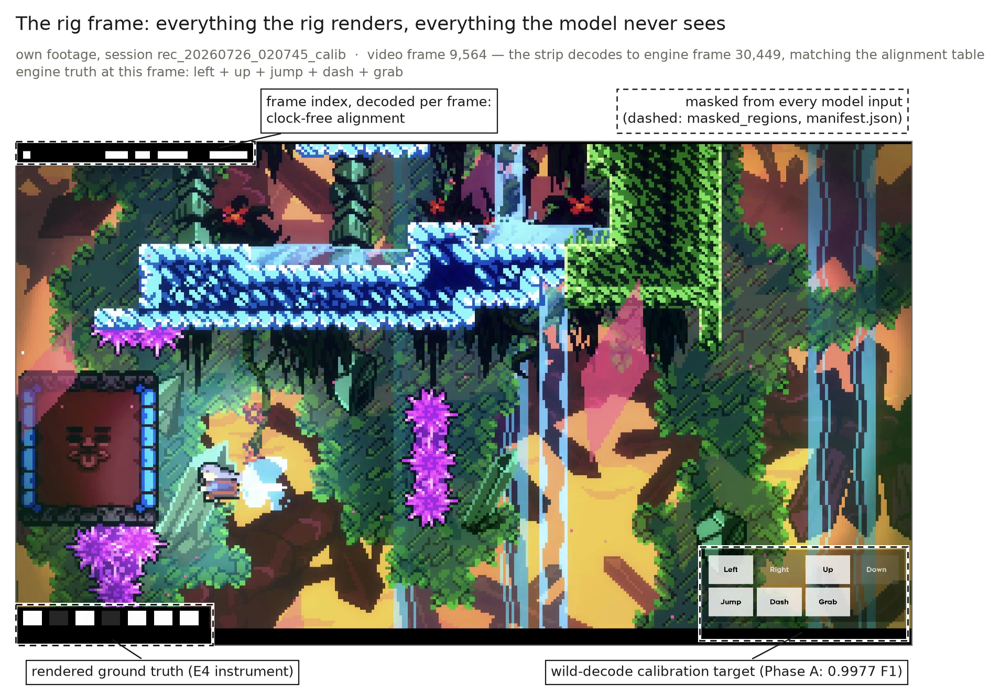

Every session records:

- exact video-to-engine alignment;
- duplicate and missing frame counts;
- action and player-state tables;
- answer-key mask geometry;
- hashes and provenance;
- an immutable train, development, diagnostic, or untouched-test role.

The frame-index strip and any visible input overlay are blacked out before a
model sees a frame. **Mask-coverage defect, found 2026-07-26 and fixed 2026-07-27** (full
record in the working repository's findings log): the declared overlay mask
rect undershot the rendered cells by ~23 source pixels, leaving a readable
answer-key sliver in own-data shards (single leaked feature: AUC 1.000 for
`left` in a training shard). The declared rects themselves verified zero —
the assertion policed the wrong boundary. No transferable benefit was
observed on held-out sessions, but that does not rule out training
distortion. Subsequent measurement narrowed the affected set: the
2560×1440-geometry sessions — including the val-A development session —
were covered all along, and the leak was confined to the 1710-family
sessions. The manifest geometry is now corrected for every session, all
own-data shards were rebuilt, and a margin-band leak scan of the rebuilt
shards passes (in-rect max 0; worst outside-rect patch AUC 0.852 vs 1.000
at the old leak site; results/mask_leak_scan.json). The own-data trainings
were re-run on the rebuilt shards on 2026-07-28: the sliver does not explain
the own-only model's near-chance ranking (see
[OWN_V3_RERUN.md](../results/idm/OWN_V3_RERUN.md)).

### Mapped NitroGen data

NitroGen provides per-frame gamepad labels and source metadata. MADELEINE
recovers the available source videos, masks controller widgets, maps controller
buttons into the seven-key schema, and splits continuous runs at missing
20-second chunks.

The data funnel is deliberately explicit:

| Stage | Videos | Hours |
|---|---:|---:|
| Extracted Celeste labels | 411 | 684 nominal |
| Historical source video recovered | 244 | 213.0889 label-hours |
| Historically had an eligible 60-Hz chunk | 221 | 192.9 |
| Media durably preserved | 232 | 164.4222 label-hours |
| Strict, durable, feature-eligible corpus | 211 | 150.9167 |
| Higher-confidence bindings | 93 | 106.00 |

Binding confidence, joystick-axis sign, source cadence, viewport, continuity,
and visual anomalies remain separate fields. The complete strict corpus is not
described as uniformly clean.

Twelve historical downloads are absent from the durable archive; ten of them
account for the difference between the 221-video historical eligible pool and
the 211-video strict durable corpus. The tracked evidence does not identify why
those files were not preserved.

The first funnel stage is itself a provenance result: **31% of the
released label-hours were retrievable at source** at census time
(2026-07-25, by our fetch method). Every unretrievable source was
Twitch-hosted while all YouTube sources remained live — consistent with
Twitch's documented VOD retention windows — and the loss is top-heavy:
the eight largest dead videos account for ~54 hours, so the surviving
slice under-represents exactly the sustained play a scaling study
wants.

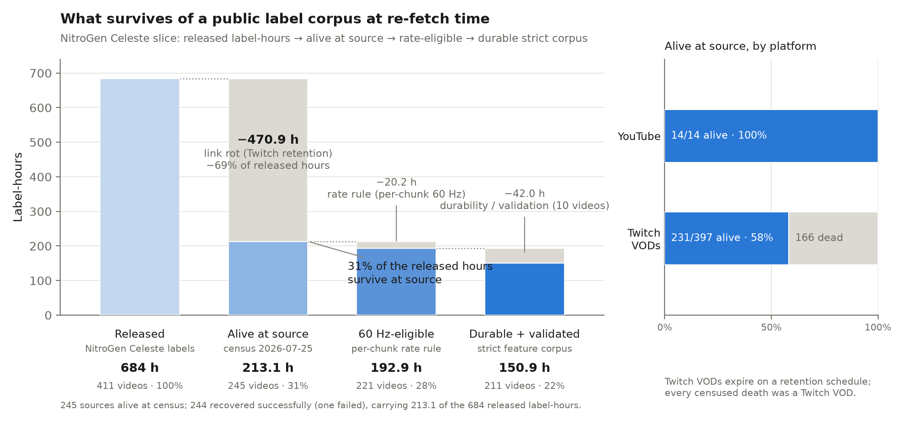

### Wild keyboard overlays

A separate path recovers keyboard actions from visible input displays in
public gameplay — a label channel structurally invisible to gamepad-overlay
pipelines, because the keyboard speedrunning community at the top of the
skill curve does not render controller widgets.

The channel was measured before it was built. Enumerating the speedrun.com
Celeste leaderboards yields **7,071 fresh PC candidate videos carrying 6,757
video-hours** — 35× the trainable NitroGen label-hours, comparing candidate
video-hours against post-curation label-hours: different funnel stages, and
the comparable figure after style-rate and decode gates would be far
smaller. A stratified 60-video style survey (55 probed successfully) found
about 15% carry an input display — a small-sample rate, not a census — and
the dominant style is a
*translucent* action HUD (11%), not the opaque key grid prior work assumes
(2%) — which redirected the decoder design toward local-contrast reading
(validated at 0.9977 against engine truth; see instruments above).

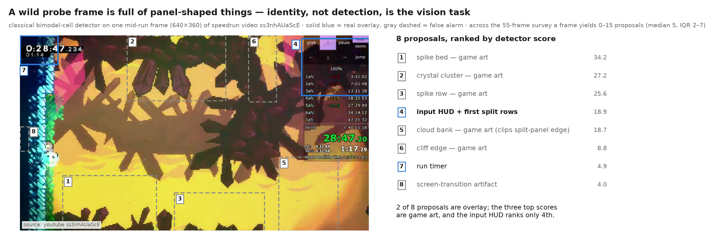

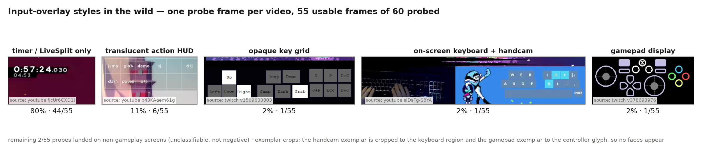

Layouts, gameplay boundaries, and video-to-overlay offset are proposed
automatically but admitted only through source-bound, hash-bound human-review
artifacts; an automated reviewer can never admit data. Of the frozen first
tranche, 33.2 media hours are fetched and byte-verified to durable storage,
~10.4 hours of gameplay windows are machine-proposed, 5.4 hours are
provisionally decoded — and the funnel held **every hour at zero until all
gates closed**: nothing trains until the reviews pass. On 2026-07-28 the
first six videos cleared their human reviews and the first publications
completed; by the following morning the funnel was fully drained — 13.93
hours across all seven human-cleared videos published through every gate,
with the one remaining reviewed candidate excluded by a hard offset-gate
failure on genuinely mixed evidence. One
provisionally decoded video was earlier rejected by the mechanical gates
for a broken dash cell — a decoder threshold defect since found, fixed, and
regression-tested.

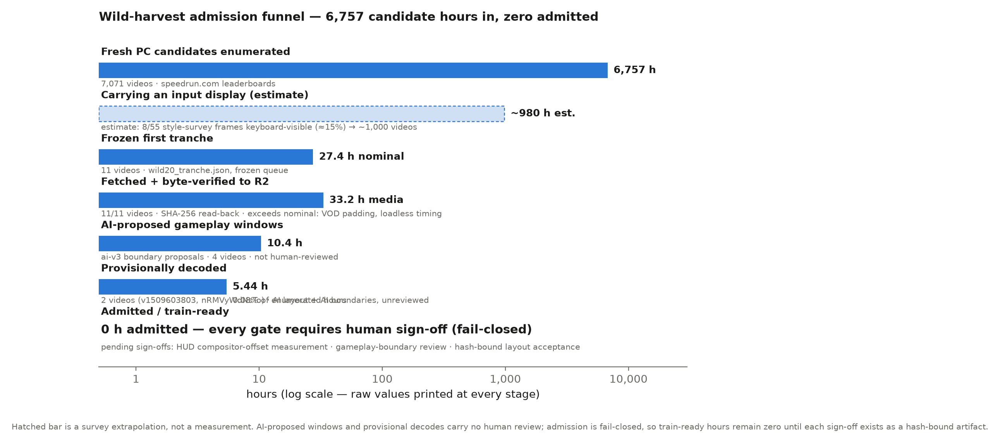

## What the instruments established

Before any model result, the rig itself produced findings that stand on
engine truth alone. They shape everything downstream: the metrics, the
architecture window, and the data strategy.

**The capture chain is internally consistent end to end.** A classical (no-ML) parser
read the rendered input overlay off 53,369 video frames and matched the
engine-truth log at macro-F1 1.0 on every key. Overlay rendering, video
capture, frame-index decoding, and alignment are all exact simultaneously, or
that number is unreachable.

**Near-identical states often carry different actions.** On 160,409 input-active
engine-truth frames, 44.8% of active moments have a temporally separated,
near-identical engine-state neighbor (tight tolerance) that carries a
*different* action; at looser tolerances the ambiguity rate rises toward
95%. Different-action revisits become observably distinguishable over the
following 8–16 frames as the action's effect compounds. The source of the
ambiguity is real behavior — repeated retries of the same room sections.
This measurement, not a citation, is why the models read future context, and
why the main window is centered with 16 future frames.

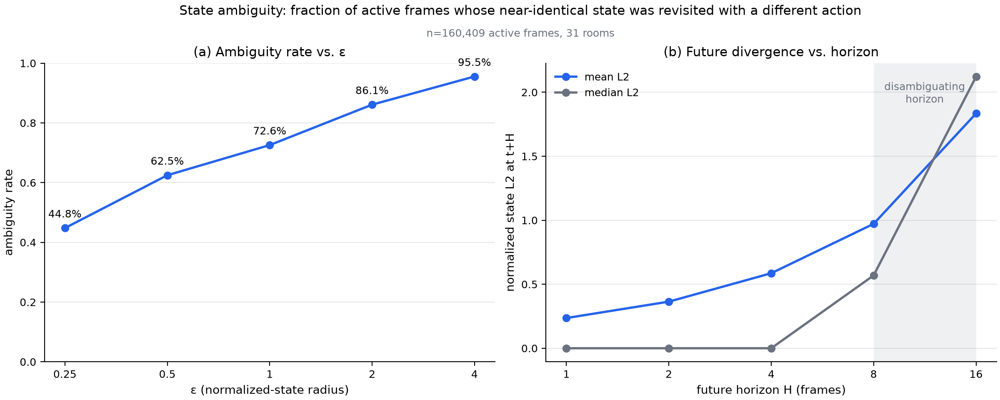

**Label timing dominates among the tested degradations; the tested video
degradations are not.** A controlled ±1-frame label shift costs 4.5%
macro-F1 (±2: 8.9%, ±4: 17.3%), while internet-grade transcodes — 30 fps,
500 kbps, 480p — cost nothing on retained, exactly realigned frames of a
legible overlay. The acquisition risk in overlay-harvested labels is timing
provenance and extraction quality, not the codec. The clean, high-contrast
overlay is the best case; the result locates the risk, it does not bound
messier overlays.

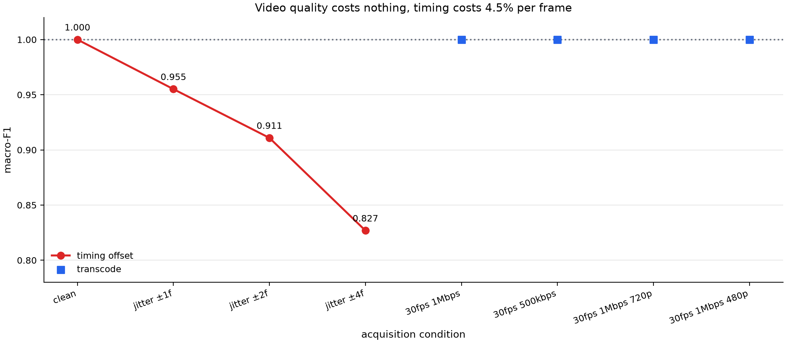

**A translucent overlay still carries the signal.** The wild channel's gate
question was whether a semi-transparent HUD composited over moving gameplay
can be decoded at all: no fixed threshold exists in principle. Reading local
contrast — each cell minus its surrounding panel — cancels the background:
macro-F1 0.9977 unsupervised against engine truth on 35,119 frames, 873/874
onsets matched at median offset zero. Scope limits are stated in the findings
log: this does not prove cell *location* in arbitrary HUDs, external
compositor lag, or that smaller real HUDs decode as cleanly.

**Recorded and harvested play are different distributions, measured.**
Harvested expert play carries 4–15× the input density of our recorded
novice play (e.g. 39.9% of left-presses are sub-50 ms taps versus 4.3%),
with shorter dashes and much longer grabs. Own-play results are scoped
accordingly, and matched-hours comparisons state the shift.

## Models

The core model uses a ResNet-18 visual representation and a recurrent temporal
head with seven sigmoid outputs. Experiments vary:

- 2, 16, 32, or 128 sampled frames;
- past-only versus centered context;
- frozen ImageNet features versus end-to-end visual learning;
- 0.725M to 112.95M trainable parameters;
- class balancing and transition weighting;
- fixed-final versus validation-selected checkpoints.

The long-context configuration uses 128 samples at stride three, spanning 382
raw frames or about 6.37 seconds.

## Evaluation

At 60 Hz, per-frame metrics are dominated by held keys and no-op frames.
The measurement that makes this concrete: **copying the previous frame's
keys scores 0.912 per-frame macro AP and 98.95% per-key accuracy — and
0.000 transition-event F1 at an exact-frame collar.** A ±1-frame collar
hands the same trivial rule a near-perfect event score, because its every
"event" is an echo one frame late. Exact-frame matching is therefore the
primary setting, and it is affordable only because frame↔label alignment is
strip-verified.

Reports include:

- macro and per-key average precision (AP);
- label prevalence as the random-score AP baseline (the AP a constant
  predictor earns: each key's press rate);
- held-state F1;
- onset and release F1 at exact and ±2-frame collars;
- VPT-style per-frame key-state accuracy, under both readings (below);
- prediction support and continuity runs;
- threshold and checkpoint provenance.

**Metric lineage.** Event-level F1 with a tolerance collar and one-to-one
matching is standard practice in adjacent fields: sound event detection
(Mesaros et al. 2016; the DCASE convention uses a 200 ms onset collar),
music onset detection (MIREX, ±50 ms — ±3 frames at 60 Hz), and action
segmentation (Lea et al. 2017's F1@k, whose stated rationale is that
frame-wise accuracy hides over-segmentation and timing failure). Three
choices here are our own and are stated as such: collar 0 as the primary
operating point (defensible only because the labels are engine-exact),
onsets and releases matched as separate events per key, and the persistence
baseline — imported from forecasting practice — paired with every table.

**Comparison to VPT's headline metric.** VPT reports "90.6% keypress
accuracy" without defining the aggregation; circumstantial evidence (their
training curves start near zero at initialization, and the 35% null-action
rate makes a joint criterion informative) suggests joint
exact-match over all ~20 keys, so we report both readings with the trivial
baselines VPT omits (scorer and full inventory:
[KEYPRESS_ACCURACY.md](../results/idm/KEYPRESS_ACCURACY.md)):

| val-A, input-active, 0.5 threshold | per-key micro | joint exact-match |
|---|---:|---:|
| 113M end-to-end IDM | 67.62% | 12.39% |
| always-released (trivial) | 82.85% | 33.60% |
| persistence (copy keys[t−1]) | **98.95%** | **93.32%** |
| VPT reported (different game, ~20 keys, reading undefined) | — | 90.6% |

Under every reading, trivial baselines dominate every learned model at this
data scale — while scoring zero on exact events. Accuracy and event skill
are near-orthogonal here — among the learned models, accuracy rank roughly
*inverts* timing rank (Spearman ρ = −0.69 across eight models: the
foreign-trained models with the best event F1 pay the largest accuracy
penalty at the untuned threshold, a direct footprint of the
transition-weighted loss). Both metric families are reported, and neither
is presented without its baselines.

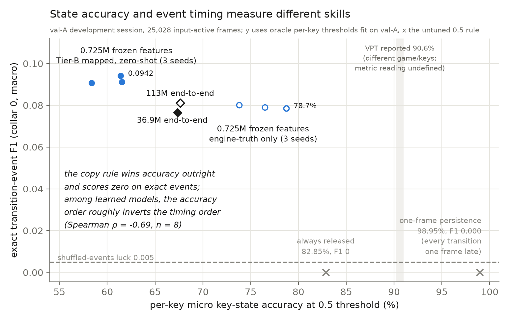

The existing local development split has been used for debugging, checkpoint
selection, and oracle thresholds. Its scores are development evidence, not an
untouched estimate. NitroGen holdouts use noisy mapped labels rather than engine
truth and answer a different question.

## Results

### Small-scale training memorizes

At 40 training minutes of engine truth, pixels-only models fit their
training sessions to near-perfect per-key AP while holdout performance sits
at chance (train BCE 0.05–0.07 against validation 0.74); three independent
instruments tested and supported the alignment and train-fit hypotheses
(lag-0 onset alignment, the dash freeze-frame fingerprint, train-fit
AP ≈ 1.0); they did not test mask coverage, where a defect was later
found. Scaling own data 15 → 25 →
40 minutes is flat at the floor (event F1 0.0221 / 0.0191 / 0.0208 against
a shuffle-luck anchor of ~0.005). Recording more data of this kind is not the fix;
foreign labels are the most direct remaining lever; architecture,
objective, and label quality remain open alongside it.

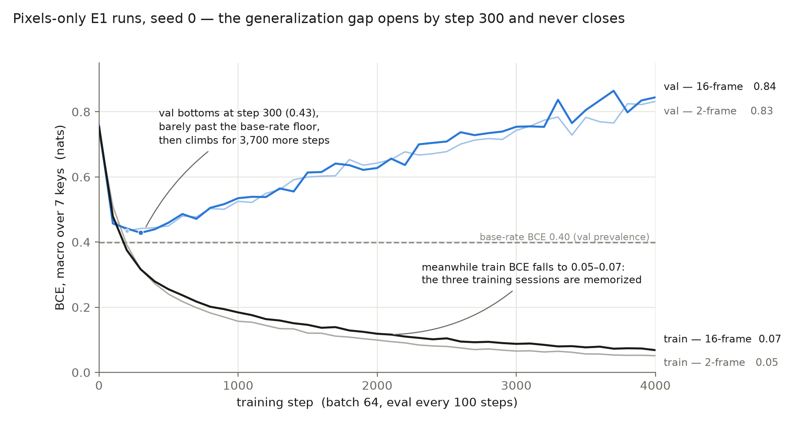

In the same grid, the causal question could not be answered: 16-frame
non-causal vs past-only differ by +0.001 event F1, zero within seed noise,
because every arm memorizes before generalization becomes cheaper. The
apparent five-fold advantage of action-history inputs dismantles under the
event metric and a 0.5 s history gap: the ungapped arm's 0.936 per-frame AP
collapses to 0.037 event F1, and gapping it drops it to pixels-level 0.023
— label leakage through time, not a policy prior. The inversion where
pixels+history scores *below* history alone reproduces across grids.

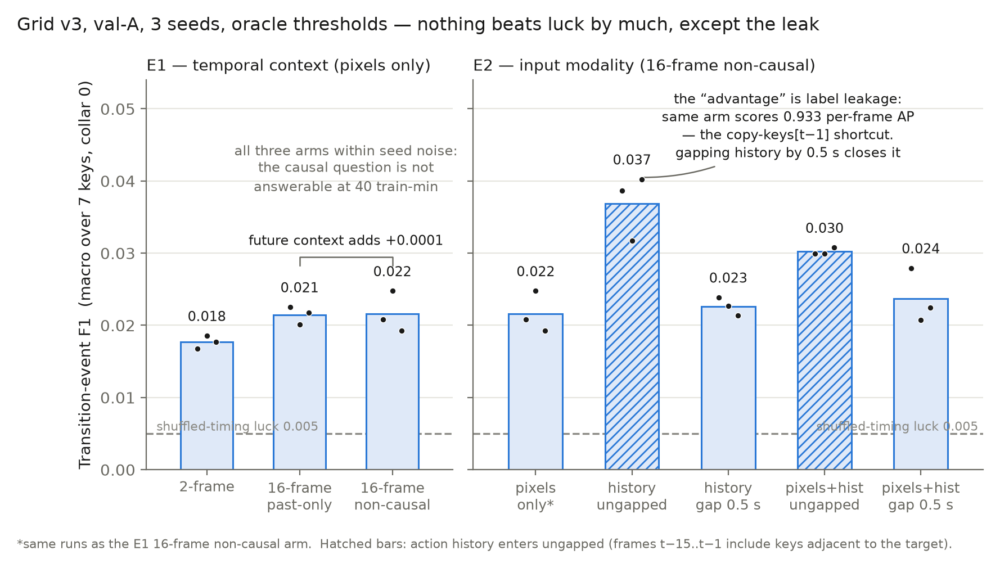

### Curated mapped supervision improves development transfer

Three paired seeds compared engine-truth-only training with pretraining on a
13.45-hour, three-creator mapped NitroGen set.

| Development result | Macro AP | Exact event F1 | ±2-frame event F1 |
|---|---:|---:|---:|
| Engine-truth-only (mask-corrected v3), mean | 0.1700 | 0.0784 | 0.0902 |
| Mapped-pretrained, mean | **0.1941** | **0.0920** | **0.1076** |
| Paired change | **+0.0241** | **+0.0136** | **+0.0174** |

Every seed improved in AP and exact event F1. The engine-truth column is
the corrected own-v3 rerun on the mask-fixed shards; the superseded
mask-era rows (mean 0.1735 AP, paired +0.0206) are preserved in the
results summary for provenance. Thresholds were selected on the same development
session, so this comparison is a development result; the executed untouched
test above is its out-of-sample check, and the pre-registered battery
extends it.

The selected recipe is **zero-shot**: the mapped-trained models saw no
engine-truth frames in training. Fine-tuning on the local gold was tested
and rejected — it was seed-unstable and degraded exact timing in every seed,
a design LAPO also reports — grounding latent actions with a small
decoder over a frozen representation rather than full fine-tuning (see
references).

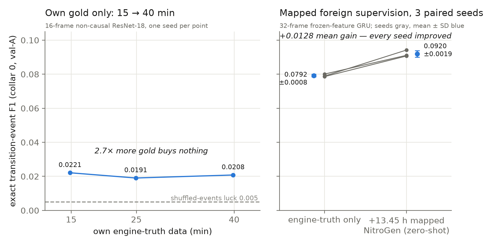

What the current best foreign-trained model looks like against engine truth,
frame by frame:

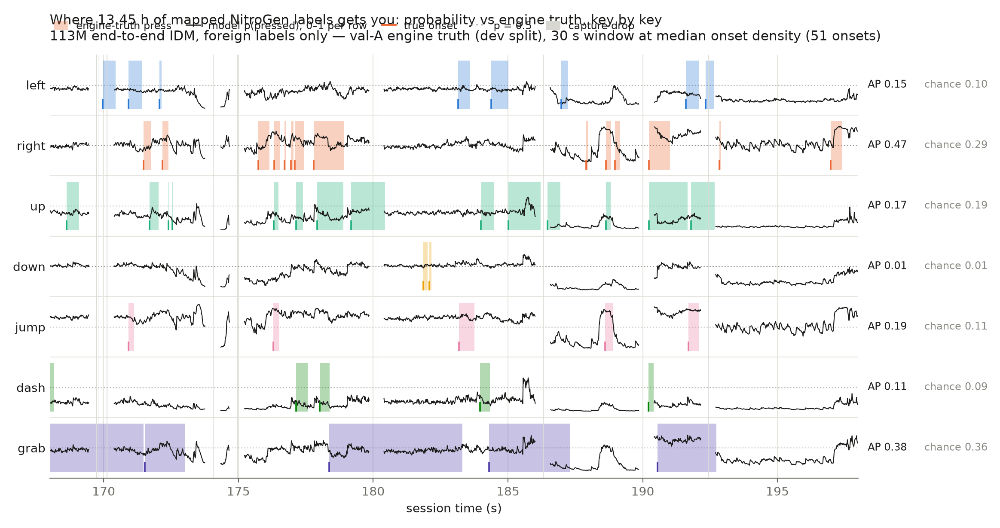

### More curated data helps state more than timing

Expanding mapped supervision from 13.45 to 40.61 hours produced a positive
fixed-endpoint mean AP change of 0.0156 across three seeds. Exact event F1
changed by 0.0002 and ±2-frame F1 was flat. One validation-selected checkpoint
chose the untrained initialization because checkpoint BCE did not match the
transition-weighted training objective. Fixed endpoints are therefore the
cleaner scale comparison.

### Capacity and visual learning separate

In a diagnostic at the same fixed endpoint, a 25.7M frozen-feature temporal
head reached 0.2944 state F1 versus 0.2486 for the 0.725M reference, while
exact event F1 changed from 0.0921 to 0.0903. This is not an isolated capacity
ablation: the larger model is one seed, the reference is a three-seed mean,
and the runs used different segment-delta semantics.

End-to-end training of a 36.9M-parameter model had a larger visual effect. A
matched 112.95M follow-up widened the projection and GRU without changing the
pixel corpus, context, optimizer, batch, or endpoint:

| Curated 13.45-hour model | Macro AP | State F1 | Exact event F1 | ±2-frame event F1 |
|---|---:|---:|---:|---:|
| Frozen features, 0.725M, three-seed mean | 0.1941 | 0.2068 | **0.0920** | **0.1076** |
| End-to-end vision, 36.9M, seed 0 | **0.2461** | **0.2510** | 0.0764 | 0.0879 |
| Wider end-to-end model, 112.95M, seed 0 | 0.2318 | 0.2194 | 0.0810 | 0.0919 |

The 36.9M end-to-end AP is 43% above the local prevalence baseline of 0.1715,
but it does not recover sharper transitions. Tripling parameter count then
reduced AP and state F1, with only a 0.0046 exact-event-F1 increase. The wider
run took about 100.5 minutes end to end versus about 35 minutes for 36.9M.
This single-seed result argues against treating temporal width alone as the
remaining constraint.

The same selected checkpoints were then evaluated on the cleaner B1
engine-truth development capture. The 36.9M and 112.95M models reached 0.2422
and 0.2388 AP, 0.3091 and 0.2958 state F1, and 0.0610 and 0.0613 exact event
F1. This second development surface corroborates the absence of a monotonic
width gain. B1 thresholds were selected on B1 itself; it is not an untouched
test.

### NitroGen-only unseen-video holdout

A 25.7M long-context model trained on nine NitroGen videos was evaluated on a
tenth video never used for training.

| Macro AP | Prevalence AP | State F1 | Exact event F1 | ±2-frame event F1 |
|---:|---:|---:|---:|---:|
| **0.2435** | 0.1924 | 0.2745 | 0.0127 | 0.0395 |

Every key exceeded its own prevalence. Scaling the same recipe to the full
corpus extended the result: 0.2693 macro AP at 103.41 h (higher-confidence
bindings) and 0.2723 at 148.32 h (all bindings), with state F1 0.2888 and
0.2986 respectively, while exact event F1 stayed near 0.013 at every scale
(complete tables in the results summary). The result establishes cross-video
mapped-label signal and an end-to-end working loader/evaluator path. It does not
establish engine-truth transfer or accurate transition timing; event thresholds
were oracle-selected on the same holdout.

### Long context remains diagnostic

The 6.37-second models could score only 1,125 targets in the existing local
development capture because most continuity runs were too short. On that common
support, long context improved ±2-frame event F1 by about 0.05 while exact F1
was nearly flat. The subset is small and easier than the complete session, so
this is not a headline context result.

## Additional metrology notes

- Known NitroGen chunk gaps remove only about 1.1% of potential long-context
  targets when treated as hard boundaries.
- Binding uncertainty affects 44.92 hours of the strict corpus and is a larger
  known semantic risk than sparse chunk gaps.
- Nominal frame rate can disagree dramatically with decoded cadence; one
  nominal-60 source averaged 33.89 fps and required timestamp-aware sampling.

## Relation to prior work

**Against VPT** (Baker et al. 2022), the natural anchor: their IDM is 0.5B
parameters over a 128-frame, 6.4 s non-causal window at 20 Hz, trained on
1,962 contractor-labeled hours. The long-context models here (0.725M and
25.7M, 128 samples at stride 3) span 6.37 s at 60 Hz — a near-identical
temporal receptive field; the largest model trained here (112.95M,
32-frame window) is still roughly a quarter of their parameter count, on
under 1% (13.45 h) to about 8% (148.3 h) of their labeled hours. The
remaining gap to VPT's reported accuracy is a priced statement rather than
a mystery: their operating point is 1,962 contractor-labeled hours and a
0.5B non-causal model (about 4 days on 32 A100s in 2022). The documented
path here — 192.9 trainable NitroGen hours, an enumerated wild channel
with roughly a thousand classified candidate hours (of 6,757 enumerated)
behind fail-closed admission, and
architecture scaling already exercised to 113M — reaches that operating
point for on the order of a few thousand dollars of compute, and the
scaling measurements in this report (accuracy and exact-match rising
steeply from 38 to 148 hours) are the evidence the path is real. VPT
evaluates its
IDM with two numbers (keypress accuracy and mouse R², definitions unstated,
no trivial baselines, single-seed curves); the accuracy comparison under
both readings is in Evaluation above. Their data-efficiency result — the
non-causal IDM matches a behavioral-cloning model trained on two orders
of magnitude more data — is a validation-loss statement about IDM versus
BC, two settings that differ in more than causal masking; it is not a
single-variable causality ablation. The event-level version of that
experiment
(E1 above) is not answerable at this project's gold scale, and their own
downstream analysis (utility saturating at 100 h while accuracy still
climbs at 1,962 h) supports this report's metric argument. Their
temporally consistent augmentation recipe is adopted in the end-to-end
runs; their appendix pathology — independent per-key heads emitting joint
configurations that never occur — is a stated limitation of the seven-head
design here.

**Against the classical IDM lineage** (Nair 2017; Torabi's BCO 2018; the
2019 imitation-from-observation survey): the canonical IDM is a single
(s_t, s_{t+1}) transition model — this project's 2-frame baseline *is* that
model, and the grids measure what the field gained by abandoning it. That
lineage never evaluates the IDM directly (only downstream task return), and
its labels come from self-generated interaction, so label quality and label
timing — this project's central objects — do not arise there. We are not
aware of prior work publishing an onset-timing error budget for actions
recovered from video; NitroGen's own extraction quality is reported as per-frame
button accuracy (0.96) on its authors' recordings, with no temporal
structure — the gap the metrology here fills.

**Against the modern latent-action line** (Genie, LAPO, and successors):
those systems learn action-like latents from unlabeled video plus a small
grounding set. LAPO observes that such latent policies model the visible
effects of actions rather than the actions themselves; we propose the
analogous mechanism — effect timing recovered instead of press timing — as
an explanation for this report's recurring observation that vision,
capacity, and context improve state recognition without improving exact
timing. That attribution is our inference, not a claim the cited papers
test. Event-timestamp
IDMs for desktop video (2025–26) confirm future context is necessary and
bound its useful horizon near 100 ms, consistent with the E3 horizon and
with long context failing to sharpen exact events here. Their
tolerance-window event metrics are far laxer than collar-0; none report
absolute timing error. The most relevant contemporary system is D2E's
Generalist-IDM (Choi et al., 2025): a roughly 1B-parameter model that
represents keyboard and mouse interactions as timestamp-based event tokens
rather than per-frame states, trained on 259 hours of human desktop
demonstrations and used to pseudo-label over a thousand more. Its sparse
event-token output space makes the persistence shortcut structurally
impossible — the architectural direction this report's
recognition-versus-timing decomposition motivates — but it reports
tolerance-window agreement on its own label distribution, not
engine-verified collar-0 timing, so the two lines of work measure
different things: D2E scales event-token supervision; this project
measures what any such supervision can claim about exact press timing.

## Interpretation

The evidence supports four claims:

1. The data and evaluation pipeline can learn action signal above prevalence on
   unseen video.
2. Curated mapped supervision improves transfer to the local development
   distribution.
3. Trainable vision improved held-action state more than exact event timing,
   but further widening from 36.9M to 112.95M did not improve state ranking;
   the older frozen-feature capacity comparison also retains a known
   loader-semantics confound.
4. Transition quality must be optimized and selected explicitly; it is not an
   automatic consequence of lower state loss or more data.
5. Expanding the matched frozen-feature corpus from about 38 to 103 and 148
   hours improves mapped-holdout AP (0.2435 → 0.2693 → 0.2723), while exact
   event F1 remains near 0.01. The all-valid arm also slightly exceeds the
   filtered arm in B1 AP, so uncertain mappings should be measured rather than
   discarded by default.

6. The untouched engine-truth test now exists, executed 2026-07-28 as one
   pre-registered pass over ten frozen models (see the results summary and
   `results/idm/untouched_test/`). Transfer to a genuinely unseen session —
   novice play, an unseen chapter with launch-orb mechanics, 15 minutes —
   is substantially below every development-surface number: best macro AP
   0.2377 against 0.1515 prevalence chance, mapped-supervision families
   above chance while the mask-era own-data seeds sit near it, collar-0
   event F1 at 4–15× the shuffled anchor but at most 0.034 absolute.
   Nothing was tuned after the numbers were seen. This is one point under
   maximal distribution shift, not a characterization across content; a
   pre-registered multi-session battery (familiar-chapter and
   unseen-chapter captures) is the follow-up.

The evidence does not yet support a claim of monotonic scaling across the
full corpus or a universal advantage for future context, and the single
untouched session cannot yet separate content shift from model limits.

## Next experiments

1. ~~Fix the overlay-mask undershoot, rebuild own-data shards, and rerun
   the own-data trainings~~ — complete 2026-07-28; see
   [OWN_V3_RERUN.md](../results/idm/OWN_V3_RERUN.md).
2. Record and score a pre-registered untouched battery: a familiar-chapter
   session to isolate recording-transfer and an unseen-chapter session to
   pair with the existing Chapter 6 result, each scored once under the
   same frozen protocol.
3. Test an auxiliary transition head or event-aligned checkpoint objective.
4. Execute the frozen counterfactual input-timing identifiability study
   ([the full pre-registered design](../results/idm/COUNTERFACTUAL_INPUT_IDENTIFIABILITY_PLAN.md)):
   deterministic engine replay with a single press moved frame-by-frame
   across a 16-frame window, measuring how many candidate frames are
   byte-distinguishable in the model-facing pixels — the experiment that
   decides whether the exact-timing wall is a modeling failure or an
   identifiability ceiling. Designed, gated, and cost-capped before
   execution; motivated by E3's 44.8% observational ambiguity, E4's
   jitter-cost asymmetry, and the dispersion diagnostics.

Completed since the first draft: full-corpus feature validation, the matched
103.41/148.32-hour scale arms, their mapped-holdout and B1 development
evaluations, and the VPT-small topology comparison with its
preregistered calibration follow-up (see the results summary).

## Beyond labeling: the verifier direction

An inverse dynamics model has a second job this project's own admission
pipeline already performs in miniature: deciding whether a control log and
a video agree. Every wild video admitted here passes a record-consistency
check — decoded actions against visible motion, timing against the
dash-hitstop physics — and that is an IDM used as a certifier rather than
a labeler. The same construction generalizes: wherever paired
action-and-video records exist at scale, an IDM can price the agreement
between them, flag records whose actions could not have produced their
video, and bound the timing error of records that pass. The metrology in
this report — trivial baselines, event-level matching, uncertainty bounds
on recovered offsets — is what makes such a certificate mean something.

## References

- Baker et al., *Video PreTraining (VPT): Learning to Act by Watching
  Unlabeled Online Videos*, 2022. [Paper](https://cdn.openai.com/vpt/Paper.pdf) ·
  [arXiv:2206.11795](https://arxiv.org/abs/2206.11795) ·
  [overview](https://openai.com/index/vpt/)
- NVIDIA et al., *NitroGen* dataset, 2026.
  [Versioned dataset card](https://huggingface.co/datasets/nvidia/NitroGen/tree/b171bc8ed2e3c311e9305ebb993c56ef565ab509)
  · [arXiv:2601.02427](https://arxiv.org/abs/2601.02427)
- Choi et al., *D2E: Scaling Vision-Action Pretraining on Desktop Data for
  Transfer to Embodied AI*, 2025.
  [arXiv:2510.05684](https://arxiv.org/abs/2510.05684)
- Agrawal et al., *Learning to Poke by Poking*, 2016.
  [arXiv:1606.07419](https://arxiv.org/abs/1606.07419)
- Nair et al., *Combining Self-Supervised Learning and Imitation for
  Vision-Based Rope Manipulation*, 2017.
  [arXiv:1703.02018](https://arxiv.org/abs/1703.02018)
- Torabi et al., *Behavioral Cloning from Observation*, 2018.
  [arXiv:1805.01954](https://arxiv.org/abs/1805.01954)
- Torabi et al., *Recent Advances in Imitation Learning from Observation*,
  2019. [arXiv:1905.13566](https://arxiv.org/abs/1905.13566)
- Aytar et al., *Playing Hard Exploration Games by Watching YouTube*, 2018.
  [arXiv:1805.11592](https://arxiv.org/abs/1805.11592)
- Guss et al., *MineRL: A Large-Scale Dataset of Minecraft Demonstrations*,
  2019. [arXiv:1907.13440](https://arxiv.org/abs/1907.13440)
- Schmidt and Jiang, *Learning to Act without Actions* (LAPO), 2024.
  [arXiv:2312.10812](https://arxiv.org/abs/2312.10812)
- Bruce et al., *Genie: Generative Interactive Environments*, 2024.
  [arXiv:2402.15391](https://arxiv.org/abs/2402.15391)
- Mesaros et al., *Metrics for Polyphonic Sound Event Detection*, Applied
  Sciences 6(6):162, 2016.
  [DOI 10.3390/app6060162](https://doi.org/10.3390/app6060162)
- Bello et al., *A Tutorial on Onset Detection in Music Signals*, IEEE
  TSAP, 2005. [DOI 10.1109/TSA.2005.851998](https://doi.org/10.1109/TSA.2005.851998)
- MIREX Audio Onset Detection protocol (±50 ms tolerance, one-to-one
  matching). [Task definition](https://music-ir.org/mirex/wiki/2018:Audio_Onset_Detection)
- DCASE sound-event-detection evaluation (collar-based event F1, per
  Mesaros et al.). [sed_eval reference](https://tut-arg.github.io/sed_eval/sound_event.html)
- Lea et al., *Temporal Convolutional Networks for Action Segmentation and
  Detection*, 2017. [arXiv:1611.05267](https://arxiv.org/abs/1611.05267)
- Idrees et al., *The THUMOS Challenge on Action Recognition for Videos in
  the Wild*, 2017. [arXiv:1604.06182](https://arxiv.org/abs/1604.06182)
- Shou et al., *Generic Event Boundary Detection*, 2021.
  [arXiv:2101.10511](https://arxiv.org/abs/2101.10511)

## Reproducibility and evidence

- [Current results summary](../results/idm/SUMMARY.md)
- [NitroGen-only holdout](../results/idm/NITROGEN_HOLDOUT.md)
- [Full-corpus audit](../results/idm/CORPUS_AUDIT.md)
- [Training-data policy](../results/idm/TRAINING_DATA_POLICY.md)
- [Dataset card](../data/dataset_card.md)
- [Session contract](../specs/session_format.md)
- [Curated engineering lessons](../docs/engineering-lessons.md)
- [Build retrospective](../docs/history/how-this-was-built.md)

Configurations, run metadata, compact reports, prediction sidecars, and
checkpoint hashes are tracked in the private working repository. The public
export ships the compact reports and checkpoint hashes; run directories,
launcher scripts, full configurations, and prediction sidecars are
working-repository artifacts and are labeled as such where cited. Large
source video, feature shards, and model weights remain outside Git. The public-release process further excludes bulk
third-party frame artifacts and private infrastructure records.

Compute ran as disposable single-GPU lanes; the durable data home is object
storage (~370 GB at the close of the build window, ~1.5 TB after the wild
harvest, byte-for-byte verified on write throughout, free egress), so
data lifetime is decoupled from machine lifetime and any host can be
rehydrated from manifests. One measured cost lesson is recorded for reuse:
tens of thousands of small chunk objects made per-operation charges the
dominant migration line item; consolidating into larger objects is the
known fix.
